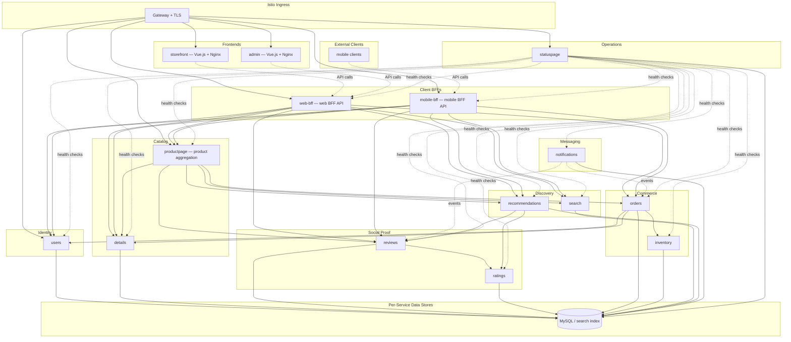

# Architecture

This document describes **runtime structure, trust boundaries, and communication** for the BookInfo platform. It complements [product.md](product.md) (vision and features) and [tech.md](tech.md) (build and stack).

## C4-style context

- **Actors** — Customers reach the platform through the `storefront` SPA; operators use the `admin` SPA; mobile clients use the `mobile-bff` API. The web frontends are served as static assets via Nginx behind the Istio ingress gateway over TLS-terminated HTTP.
- **System** — The BookInfo Kubernetes namespace hosts thirteen Spring Boot services, two Vue.js + Nginx frontends, the Envoy data plane (sidecars), and supporting config (Secrets, ConfigMaps, NetworkPolicies).
- **External systems** — Certificate authority via cert-manager; external SMTP, push, or search clusters behind Istio `ServiceEntry` for controlled egress.

## Service topology

Fifteen services organized across identity, BFF, catalog, social proof, commerce, discovery, messaging, operations, and frontend domains. Backend services own their data stores where needed and participate in the Istio mesh. The web frontends consume the `web-bff` API, while mobile clients consume the `mobile-bff` API.

## Call patterns

- **Browser → Storefront** — Customers load the `storefront` Vue.js SPA from Nginx via the Istio ingress gateway.
- **Browser → Admin** — Operators load the `admin` Vue.js SPA from Nginx via the Istio ingress gateway (separate path or hostname).
- **Frontend → Web BFF** — Both SPAs make JSON API calls to `web-bff` through the Istio ingress gateway. `web-bff` returns role-scoped responses: customer endpoints for `storefront`, admin endpoints (review moderation, inventory management, order management) for `admin`. CORS is handled at the gateway or BFF level.
- **Mobile → Mobile BFF** — Mobile clients call `mobile-bff` through the Istio ingress gateway. `mobile-bff` returns mobile-shaped payloads and owns mobile-specific API versioning.
- **Synchronous HTTP** — `web-bff`, `mobile-bff`, and `productpage` fan out to product and domain services as needed. `productpage` aggregates product details from `details`, `reviews`, `search`, `recommendations`, and `orders`. `reviews` calls `ratings`. `orders` calls `inventory`, `details`, and `users`. `statuspage` calls all backend services' Actuator health endpoints.
- **Async events** — `notifications` consumes domain events published by `orders` and `reviews` (via Kafka, RabbitMQ, or REST callbacks as the messaging infrastructure is wired).
- **Mesh layer** — Every call passes through Envoy sidecars that enforce mTLS, apply VirtualService routing rules, emit telemetry, and enforce AuthorizationPolicy (which workloads may call which services).

## Authorization matrix

Istio `AuthorizationPolicy` enforces least-privilege service-to-service communication. Kubernetes `NetworkPolicy` provides a second layer of defense.

| Source | Allowed Destinations |
| --- | --- |
| Istio ingress gateway | `storefront`, `admin`, `web-bff`, `mobile-bff`, `productpage`, `users`, `statuspage` |
| `storefront` | Static assets only (API calls route through ingress to `web-bff`) |
| `admin` | Static assets only (API calls route through ingress to `web-bff`) |
| Mobile clients | API calls route through ingress to `mobile-bff` |
| `web-bff` | `productpage`, `details`, `reviews`, `search`, `recommendations`, `orders`, `users` |
| `mobile-bff` | `productpage`, `details`, `reviews`, `search`, `recommendations`, `orders`, `users` |
| `productpage` | `details`, `reviews`, `search`, `recommendations`, `orders` |
| `reviews` | `ratings` |
| `orders` | `inventory`, `details`, `users` |
| `notifications` | `orders`, `reviews` (event read path), egress to external SMTP/push |
| `recommendations` | `ratings`, `reviews` |
| `statuspage` | All backend services (Actuator health endpoints only) |
| All other paths | Denied by default |

## Cross-cutting concerns

| Concern | Application layer | Platform layer |
| --- | --- | --- |
| Encryption in transit | HTTPS clients where applicable | Istio mTLS between pods; Gateway TLS at ingress |
| Identity & authentication | Spring Security JWT/OAuth2 in `users` | Istio `RequestAuthentication` for mesh-level JWT validation |
| Authorization | Spring Security on sensitive endpoints (e.g., DELETE reviews, order mutations, admin-scoped BFF endpoints) | AuthorizationPolicy for service identities (see matrix above) |
| Resilience | Resilience4j timeouts, circuit breakers, retries in `web-bff`, `mobile-bff`, `productpage`, `orders`, `reviews` | DestinationRule connection-pool defaults, routing, and fault injection for tests |
| Saga coordination | Outbox or choreography in `orders` + `inventory` | Mesh-level traffic mirroring for shadow-testing new order flows |
| Egress control | HTTP clients in `notifications`, `search` | `ServiceEntry` for external SMTP, push APIs, search clusters |
| Observability | Structured JSON logs, Micrometer metrics, OpenTelemetry trace context | Envoy metrics, Kiali graph, Jaeger traces, Prometheus + Grafana |
| Network segmentation | Least-privilege APIs | NetworkPolicy default deny with explicit allows |
| Operational status | `statuspage` aggregates health from all services | Independent deployment; remains available during main app degradation |
| Frontend delivery | Two Vue.js SPAs served by Nginx (storefront + admin), backed by `web-bff`; mobile clients use `mobile-bff` | Separate Docker images and Helm values; routed via Istio VirtualService |

## Related documents

- [product.md](product.md) — Capabilities, roadmap, and milestones
- [tech.md](tech.md) — Stack and build reference
- [modernization.md](modernization.md) — Phased delivery plan
- [jiraboard.md](jiraboard.md) — Tickets BOOK-1 through BOOK-32
