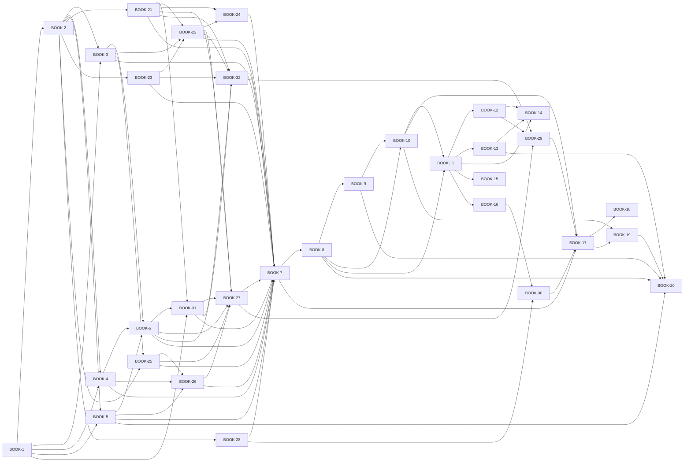

# BookInfo modernization — task board

Use the checkboxes to track progress (`[ ]` → `[x]` in your editor or on GitHub/GitLab).

**Epic BOOK-0:** Build a fifteen-service bookstore platform on Istio (thirteen Kotlin + Spring Boot backends plus two Vue.js + TypeScript frontends) with Helm charts and GitHub Actions CI/CD — see [modernization.md](modernization.md).

Checkboxes below reflect the **current repo** (BOOK-1 Gradle foundation is done; services are Spring Boot shells without REST/Flyway yet; legacy `microservices/` and root YAML still present).

Findings are addressed through the existing tickets rather than separate cleanup-only work:

| Priority | Findings | Primary tickets |
|----------|----------|-----------------|
| P0 security | F1–F4, F8, F27 | BOOK-2, BOOK-5, BOOK-8, BOOK-13, BOOK-19, BOOK-20 |
| P1 platform safety | F5–F7, F9–F11, F20–F23, F26 | BOOK-7, BOOK-8, BOOK-9, BOOK-11, BOOK-12, BOOK-13, BOOK-16, BOOK-19 |
| P2 app correctness | F12, F15–F19, F28 | BOOK-2, BOOK-3, BOOK-4, BOOK-5, BOOK-6, BOOK-31 |
| P3 delivery/docs | F13, F14, F24, F25 | BOOK-17, BOOK-18, BOOK-19 |

| Sprint | Tickets | Points |
|--------|---------|-------:|
| 0 Findings containment | BOOK-20 | 2 |
| 1 Foundation & Flyway | BOOK-1, BOOK-2 | 5 |
| 2 Catalog & social-proof services | BOOK-3 … BOOK-5 | 11 |
| 3 Product, identity & BFF APIs | BOOK-6, BOOK-21, BOOK-31 | 15 |
| 4 Commerce & discovery services | BOOK-23, BOOK-22, BOOK-24, BOOK-25, BOOK-26 | 19 |
| 5 Frontends & statuspage | BOOK-27, BOOK-32, BOOK-28 | 14 |
| 6 Containers, Kubernetes & Helm | BOOK-7 … BOOK-10 | 16 |
| 7 Istio & observability | BOOK-11 … BOOK-16 | 21 |
| 8 Testing, CI/CD & closure | BOOK-29, BOOK-30, BOOK-17 … BOOK-19 | 13 |
| **Total** | **32** | **116** |

---

## Sprint 0 — Findings containment

### BOOK-20 — Security containment & audit (2 pts)

**Depends on:** P0 containment: —; final audit: BOOK-5, BOOK-8, BOOK-9, BOOK-13, BOOK-19 · **Blocks:** no deployment/publish until P0 items are complete

- [ ] P0: rotate or invalidate exposed legacy DB credentials before publishing or deploying the modernized stack
- [ ] P0: remove legacy `GET /deleteReviews` exposure from any active ingress path; do not carry this route into the new API
- [ ] P0: verify no committed manifest/script contains real DB credentials, external DB endpoints, or plaintext root passwords
- [ ] No SQL injection on review mutations; destructive review operations are not exposed as `GET`; 403 on unauthorized delete
- [ ] No real credentials, external DB endpoints, or plaintext root passwords remain in committed manifests/scripts
- [ ] Istio mTLS verified (STRICT mode, no plaintext service-to-service traffic)
- [ ] Istio AuthorizationPolicy verified (negative tests: denied paths return 403)
- [ ] NetworkPolicy verified (negative tests: pods outside allow rules cannot reach services)
- [ ] No deprecated Istio CRDs or `config.istio.io` remnants; images non-root; Trivy policy met
- [ ] Document any residual risk in `findings.md` / security notes

---

## Sprint 1 — Foundation

### BOOK-1 — Gradle multi-module (3 pts)

**Depends on:** — · **Blocks:** BOOK-2, backend service work, BFF shells, packaging

- [x] Root `build.gradle.kts`: Detekt, JaCoCo, Spring Boot subprojects (`test` / `integrationTest` / tags)
- [x] `settings.gradle.kts` includes all currently scaffolded backend service modules
- [x] `gradle/libs.versions.toml` (or catalog) holds shared Kotlin / Spring Boot / test dependency versions
- [x] Each currently scaffolded service module has `build.gradle.kts` and compiles
- [x] `.gitignore` covers `.gradle/`, `build/`, IDE junk
- [x] `./gradlew build` succeeds from repo root

---

### BOOK-2 — Flyway migrations (2 pts)

**Depends on:** BOOK-1 · **Blocks:** BOOK-3–5, BOOK-21, BOOK-23, BOOK-25, BOOK-28

- [ ] Add `db/migrations/` (or `services/.../resources/db/migration`) with Flyway naming (`V*__*.sql`)
- [ ] `V1__init_schema.sql`: `books` + `reviews` tables, keys, constraints, seed data aligned with legacy `bookinfo.sql`
- [ ] Migration applies cleanly against MySQL 8.4 (local or Testcontainers)
- [ ] DB credentials are externalized; no migration or test fixture commits real usernames, passwords, hosts, or ports from legacy `secrets.yaml`

---

## Sprint 2 — Catalog & social-proof services

### BOOK-3 — `details` service (3 pts)

**Depends on:** BOOK-1, BOOK-2 · **Blocks:** BOOK-6, BOOK-7, BOOK-22, BOOK-25

- [ ] Spring Boot app: JPA + HikariCP, parameterized queries for `books`
- [ ] `GET /details` returns book details JSON per contract
- [ ] Actuator: health includes DB indicator; readiness/liveness wired for K8s
- [ ] Typed `@ConfigurationProperties` for DB/runtime config; missing config fails with clear validation instead of startup crashes
- [ ] Controller/repository tests; no per-request connection leaks

---

### BOOK-4 — `ratings` service (3 pts)

**Depends on:** BOOK-1, BOOK-2 · **Blocks:** BOOK-6, BOOK-7, BOOK-26

- [ ] JPA read path for ratings from `reviews` (or agreed schema); no shared mutable globals
- [ ] `GET /ratings` JSON stable under concurrent requests
- [ ] Concurrency test covers repeated parallel requests without stale module-level state
- [ ] Actuator health + tests

---

### BOOK-5 — `reviews` service (5 pts)

**Depends on:** BOOK-1, BOOK-2 · **Blocks:** BOOK-6, BOOK-7, BOOK-20, BOOK-26

- [ ] Replace string-built SQL with JPA / `PreparedStatement`-style safe queries
- [ ] `GET /reviews` with pagination (not hard-limited to 5 rows)
- [ ] `POST /reviews` with `@Valid` (rating 1–5, reviewer/review length limits, request-size guard)
- [ ] No destructive `GET /deleteReviews`; destructive review operations use proper HTTP verbs and require admin authorization
- [ ] WebClient → `ratings` with timeouts + tracing propagation
- [ ] Tests: validation errors, SQL injection attempts, auth on delete, pagination beyond 5 rows

---

## Sprint 3 — Product, identity & BFF APIs

### BOOK-6 — `productpage` product aggregation service (5 pts)

**Depends on:** BOOK-3, BOOK-4, BOOK-5 · **Blocks:** BOOK-31, BOOK-7, BOOK-27, BOOK-32

- [ ] Product aggregation API aggregates details + reviews + ratings (WebClient or RestClient)
- [ ] Resilience4j circuit breakers per downstream; degraded UI when downstream fails
- [ ] `GET /api/v1/products`, `/api/v1/products/{id}` — product-oriented JSON API reusable by BFFs where appropriate
- [ ] Explicit timeout configuration for every downstream client; no downstream call without Resilience4j protection
- [ ] Tests with WireMock for downstreams; no server-side rendering

---

### BOOK-21 — `users` service (5 pts)

**Depends on:** BOOK-1, BOOK-2 · **Blocks:** BOOK-22, BOOK-24, BOOK-31, BOOK-7 · **Mesh policy updates:** after BOOK-13

- [ ] Gradle module `services/users`, package `org.bookinfo.users`
- [ ] User accounts, sessions or OAuth2 resource-server patterns aligned with Spring Security
- [ ] JWT issuance or validation story documented; mesh integration via Istio `RequestAuthentication` where applicable
- [ ] Own Flyway migrations and database (database-per-service)
- [ ] Dockerfile, Helm values, Istio `AuthorizationPolicy` updates (who may call `users`)
- [ ] Unit and integration tests; Actuator health

---

### BOOK-31 — `web-bff` & `mobile-bff` (5 pts)

**Depends on:** BOOK-1 for shells; BOOK-3–6 and BOOK-21 for full role-scoped aggregation · **Blocks:** BOOK-7, BOOK-12, BOOK-13, BOOK-27, BOOK-32

- [x] Gradle modules `services/web-bff` and `services/mobile-bff`; packages `org.bookinfo.webbff`, `org.bookinfo.mobilebff`
- [x] SpringDoc OpenAPI, distinct API paths (`/api/v1/web`, `/api/v1/mobile`), Spring Boot Actuator with probe-ready health
- [x] Global `ProblemDetail` exception handling; kotlin-logging for server errors (no PII)
- [ ] `web-bff` serves web platforms (`storefront`, `admin`); `mobile-bff` serves mobile clients
- [ ] Downstream HTTP clients (WebClient / `RestClient`) with explicit timeouts and Resilience4j per downstream
- [ ] Role-scoped web responses and mobile-shaped payload contracts are documented in OpenAPI
- [ ] Dockerfiles, Helm values, Istio `VirtualService` routes and `AuthorizationPolicy` rows for both BFFs

---

## Sprint 4 — Commerce & discovery services

Services for commerce, inventory, notifications, search, and recommendations. Each adds application and mesh patterns documented in [product.md](product.md) (Platform capabilities).

### BOOK-23 — `inventory` service (3 pts)

**Depends on:** BOOK-1, BOOK-2 · **Blocks:** BOOK-22, BOOK-7

- [ ] Module `services/inventory`; stock levels and reservation or availability API
- [ ] Mesh-level rate limiting or `DestinationRule` tuning for hot paths documented
- [ ] Own schema and migrations; optional event publication for stock changes (if messaging added later)

---

### BOOK-22 — `orders` service (5 pts)

**Depends on:** BOOK-21, BOOK-3, BOOK-23 (inventory read path) · **Blocks:** BOOK-24, BOOK-7

- [ ] Module `services/orders`; order lifecycle, idempotency on create where appropriate
- [ ] Calls to `details` / `inventory` for validation; saga or outbox pattern documented if async steps are introduced
- [ ] Istio scenarios: traffic mirroring or canary for a new `orders` revision documented in `istio/scenarios/`
- [ ] Per-service DB, migrations, Helm + Istio policy matrix extended
- [ ] Tests and resilience (timeouts + circuit breaker on downstream calls)

---

### BOOK-24 — `notifications` service (4 pts)

**Depends on:** BOOK-21, BOOK-22 · **Blocks:** BOOK-7

- [ ] Module `services/notifications`; consumes domain events or REST callbacks from `orders` / `reviews` as designed
- [ ] Istio **egress** (`ServiceEntry`) for external SMTP, push, or third-party APIs; no plaintext secrets in Git
- [ ] Async consumer path (Kafka or RabbitMQ) if introduced — Helm subchart and mesh egress documented

---

### BOOK-25 — `search` service (4 pts)

**Depends on:** BOOK-1, BOOK-2, BOOK-3 · **Blocks:** BOOK-26, BOOK-7

- [ ] Module `services/search`; search API backed by OpenSearch/Elasticsearch or agreed embedded index strategy
- [ ] Istio connection-pool/routing defaults for search backend; graceful degradation from `productpage`, `web-bff`, and `mobile-bff` via Resilience4j
- [ ] Egress or in-cluster ServiceEntry for search cluster as applicable

---

### BOOK-26 — `recommendations` service (3 pts)

**Depends on:** BOOK-4, BOOK-5, BOOK-25 (coupling to catalog/search per integration design) · **Blocks:** BOOK-7

- [ ] Module `services/recommendations`; “readers also liked” or simple collaborative filter read path
- [ ] Fault injection or latency scenarios documented for resilience testing of `productpage` aggregation
- [ ] Clear API contracts with `productpage`, `web-bff`, and `mobile-bff` plus optional cache strategy

---

## Sprint 5 — Frontends & statuspage

### BOOK-27 — `storefront` Vue.js + TypeScript SPA (5 pts)

**Depends on:** BOOK-31 (`web-bff` API), BOOK-6 (product aggregation); full commerce/search flows depend on BOOK-21, BOOK-22, BOOK-25, BOOK-26 · **Blocks:** BOOK-7 (needs Dockerfile), BOOK-29

- [ ] `services/storefront/` with `package.json`, `vite.config.ts`, TypeScript strict mode
- [ ] Vue.js 3 component-based architecture consuming `web-bff` JSON API (customer endpoints)
- [ ] Pages: book catalog, product detail (reviews, ratings, recommendations), search, cart, checkout, login
- [ ] Multi-stage Dockerfile: Vite build stage + Nginx alpine runtime
- [ ] Non-root Nginx user, `.dockerignore`, health check endpoint
- [ ] Istio VirtualService route for the storefront alongside backend API routes
- [ ] Helm values for storefront image tag and config

---

### BOOK-32 — `admin` Vue.js + TypeScript SPA (5 pts)

**Depends on:** BOOK-31 (`web-bff` API), BOOK-6 (product aggregation); full admin flows depend on BOOK-21, BOOK-22, BOOK-23 · **Blocks:** BOOK-7 (needs Dockerfile), BOOK-29

- [ ] `services/admin/` with `package.json`, `vite.config.ts`, TypeScript strict mode
- [ ] Vue.js 3 component-based architecture consuming `web-bff` JSON API (admin-scoped endpoints)
- [ ] Pages: inventory management, review moderation, order management, service health overview
- [ ] Multi-stage Dockerfile: Vite build stage + Nginx alpine runtime
- [ ] Non-root Nginx user, `.dockerignore`, health check endpoint
- [ ] Istio VirtualService route on separate path or hostname from storefront
- [ ] Helm values for admin image tag and config

---

### BOOK-28 — `statuspage` service (4 pts)

**Depends on:** BOOK-1, BOOK-2; service fan-out targets BOOK-3–6 and BOOK-21–26 as they are available · **Blocks:** BOOK-7 (needs Dockerfile), BOOK-30

- [ ] Gradle module `services/statuspage`, package `org.bookinfo.statuspage`
- [ ] Fan-out health checks to all backend services' Actuator endpoints
- [ ] Persistent incident and uptime history in own database (Flyway migrations)
- [ ] Public-facing status view (JSON API; optionally a simple server-rendered page)
- [ ] Istio `AuthorizationPolicy` allowing statuspage to reach all services' health endpoints
- [ ] Helm values, Dockerfile, tests

---

## Sprint 6 — Containers, Kubernetes & Helm

### BOOK-7 — Docker images (3 pts)

**Depends on:** BOOK-3–6, BOOK-21–28, BOOK-31, BOOK-32 · **Blocks:** BOOK-8, BOOK-17

- [ ] Multi-stage Dockerfile per service (Temurin 21 build + slim runtime; Nginx runtime for frontends)
- [ ] Non-root user, `HEALTHCHECK`, port 9080 for backends, `.dockerignore`
- [ ] Replace all EOL Ruby/Node/Open Liberty/MySQL 5.6 image usage from legacy manifests
- [ ] `docker build` all services; `trivy image` gate (no HIGH/CRITICAL)

---

### BOOK-8 — Kubernetes manifests (5 pts)

**Depends on:** BOOK-7 · **Blocks:** BOOK-9, BOOK-10, BOOK-11

- [ ] Namespace `bookinfo` with `istio-injection=enabled` label
- [ ] Per service: `Deployment` (apps/v1), probes, requests/limits, `Service`, optional HPA/PDB
- [ ] MySQL: StatefulSet/Helm subchart, `Secret`/`ConfigMap` references only; no plaintext `MYSQL_ROOT_PASSWORD` or external DB credentials in committed YAML
- [ ] Secret values are provided through local-only values, SealedSecret, ExternalSecret, or documented operator pattern
- [ ] `kubectl apply --dry-run=client` clean for chart templates

---

### BOOK-9 — Kubernetes NetworkPolicy (3 pts)

**Depends on:** BOOK-8 · **Blocks:** BOOK-10

- [ ] Default-deny ingress per namespace
- [ ] Explicit allow rules matching the authorization matrix in [architecture.md](architecture.md)
- [ ] Defense-in-depth alongside Istio AuthorizationPolicy (Phase 4)
- [ ] `kubectl apply --dry-run=client` clean

---

### BOOK-10 — Helm chart (5 pts)

**Depends on:** BOOK-8, BOOK-9 · **Blocks:** BOOK-11, BOOK-17

- [ ] `helm/bookinfo/` with `Chart.yaml`, `values.yaml`, templates for workloads + networking
- [ ] `helm/bookinfo/istio/` subdirectory for Istio resource templates
- [ ] Value files: local, production, optional cloud overlays (`gke`, `ibmcloud`, …)
- [ ] `helm lint` + `helm template` OK; `helm install` works on kind/minikube with local values
- [ ] Image tag override via `--set` / values

---

## Sprint 7 — Istio & observability

### BOOK-11 — Istio mTLS & DestinationRules (3 pts)

**Depends on:** BOOK-8, BOOK-10 · **Blocks:** BOOK-12, BOOK-13, BOOK-14

- [ ] Istio installed on cluster (documented install steps)
- [ ] `PeerAuthentication` with `STRICT` mode in `bookinfo` namespace
- [ ] `DestinationRule` per service defining subsets (v1, v2 where applicable) and connection pool settings
- [ ] Automatic sidecar injection via namespace label; no `istioctl kube-inject` generated manifests
- [ ] Verify mTLS is enforced: `istioctl authn tls-check` or Kiali graph shows lock icons

---

### BOOK-12 — Istio Gateway & VirtualService (3 pts)

**Depends on:** BOOK-11 · **Blocks:** BOOK-14

- [ ] Istio `Gateway` resource with TLS termination via cert-manager `Certificate`
- [ ] `VirtualService` for path-based routing to `storefront`, `admin`, `web-bff`, `mobile-bff`, and productpage compatibility routes (specific hostname, not wildcard)
- [ ] Verify external traffic reaches `web-bff`, `mobile-bff`, and productpage compatibility routes through Istio ingress gateway
- [ ] No wildcard `hosts: ["*"]`; HTTP redirects to HTTPS where applicable
- [ ] Remove legacy `bookinfo-gateway.yaml` and `istio-gateway.yaml` from root

---

### BOOK-13 — Istio AuthorizationPolicy (4 pts)

**Depends on:** BOOK-11 · **Blocks:** BOOK-14, BOOK-20

- [ ] `AuthorizationPolicy` rules matching the authorization matrix in [architecture.md](architecture.md)
- [ ] Default deny-all policy for namespace
- [ ] Negative tests: verify denied paths return 403 RBAC
- [ ] Document how this layers with Kubernetes NetworkPolicy (BOOK-9) and Spring Security

### BOOK-14 — Istio traffic scenarios (5 pts)

**Depends on:** BOOK-11, BOOK-12, BOOK-13 · **Blocks:** —

- [ ] `istio/scenarios/canary-reviews-v2.yaml`: weighted routing (90/10 split)
- [ ] `istio/scenarios/header-route-reviews.yaml`: user-based routing (e.g., user `jason` → v2)
- [ ] `istio/scenarios/fault-inject-details-delay.yaml`: 5s delay on details for 10% of requests
- [ ] `istio/scenarios/fault-inject-ratings-abort.yaml`: HTTP 503 on ratings for 20% of requests
- [ ] `istio/scenarios/traffic-mirror-reviews.yaml`: mirror traffic to reviews-v2
- [ ] `istio/scenarios/rate-limit-productpage.yaml`: rate limiting via EnvoyFilter
- [ ] Each scenario has inline comments explaining what it does and how to observe the effect
- [ ] README in `istio/scenarios/` documenting apply/observe/cleanup for each

---

### BOOK-15 — Istio egress control (2 pts)

**Depends on:** BOOK-11 · **Blocks:** —

- [ ] `ServiceEntry` for external MySQL (or external API) access
- [ ] Default mesh policy: deny outbound traffic not explicitly registered
- [ ] Document the pattern: why egress control matters, how to add new external services

---

### BOOK-16 — Observability stack (4 pts)

**Depends on:** BOOK-11 · **Blocks:** BOOK-19

- [ ] Kiali deployed and configured: mesh topology, traffic flow visualization
- [ ] Jaeger deployed: distributed tracing (Istio sidecar traces + OpenTelemetry app traces)
- [ ] Prometheus + Grafana: Istio telemetry metrics + application Micrometer metrics
- [ ] Deprecated Mixer `config.istio.io` metrics/logging resources removed and replaced by Istio telemetry v2 patterns
- [ ] Pre-built Grafana dashboards for service health and mesh health
- [ ] Document how to access each dashboard and what to look for

---

## Sprint 8 — Testing, CI/CD & closure

### BOOK-29 — Frontend integration testing (3 pts)

**Depends on:** BOOK-27, BOOK-32, BOOK-12 · **Blocks:** BOOK-17

- [ ] End-to-end tests for storefront → `web-bff` API flow (e.g., Playwright or Cypress)
- [ ] End-to-end tests for admin → `web-bff` admin API flow
- [ ] CI integration: both frontend builds + lint + test in GitHub Actions workflow
- [ ] Verify Istio routing serves both frontends' static assets correctly

---

### BOOK-30 — Statuspage observability integration (2 pts)

**Depends on:** BOOK-28, BOOK-16 · **Blocks:** BOOK-17

- [ ] Statuspage aggregates Kiali health status or Prometheus service-health metrics
- [ ] Grafana dashboard for statuspage uptime history
- [ ] Document how statuspage complements Kiali for external vs. internal status views

---

### BOOK-17 — CI workflow (3 pts)

**Depends on:** BOOK-7, BOOK-10, BOOK-29, BOOK-30 · **Blocks:** BOOK-18, BOOK-19

- [ ] `.github/workflows/ci.yml` on PR + default branch
- [ ] JDK 21, Gradle cache, `./gradlew detekt`, `./gradlew test`, integration tests where applicable
- [ ] Build/push or load Docker images; Trivy on images; `helm lint`
- [ ] Fail build on HIGH/CRITICAL Trivy findings (policy as agreed)
- [ ] CI avoids legacy Travis-style deploy-and-destroy smoke test as the only validation path

---

### BOOK-18 — Deploy workflow (3 pts)

**Depends on:** BOOK-17 · **Blocks:** —

- [ ] `.github/workflows/deploy.yml` on tag and/or `workflow_dispatch`
- [ ] Push images to GHCR (or chosen registry); Helm upgrade with immutable tag
- [ ] Smoke test health endpoints; OIDC/secrets pattern (no long-lived kubeconfigs in repo)

---

### BOOK-19 — Legacy removal & docs (2 pts)

**Depends on:** BOOK-10, BOOK-17 · **Blocks:** —

- [ ] Delete legacy tree: `microservices/`, `.bluemix/`, `.travis.yml`, `scripts/`, obsolete root `*.yaml`, deprecated Istio Mixer CRDs, committed legacy `secrets.yaml`
- [ ] Root `README.md` + `QUICKSTART.md` match current Gradle/Helm/Istio flow
- [ ] Update [findings.md](findings.md) with resolution status / ticket IDs
- [ ] Remove or replace stale screenshot references and missing `images/` assumptions
- [ ] Document Istio scenarios in `istio/scenarios/` README
- [x] [docs/README.md](README.md) index stays accurate

---

## Dependency graph

## Parallel work

- P0 findings containment in **BOOK-20** must happen before any deployment or publishing work; it can run before implementation tickets finish.
- **BOOK-1 → BOOK-2** establishes the build and database migration foundation.
- **BOOK-3, BOOK-4, BOOK-5** can run in parallel after BOOK-2.
- **BOOK-21** can start after BOOK-2; mesh policy rows for `users` wait until BOOK-13.
- **BOOK-6** follows the catalog/social-proof contracts; **BOOK-31** shells may continue after BOOK-1, but role-scoped aggregation waits for BOOK-3–6 and BOOK-21.
- **BOOK-23** and **BOOK-25** can start once their data/catalog prerequisites are ready; **BOOK-22** follows BOOK-21, BOOK-23, and BOOK-3; **BOOK-24** follows BOOK-21 and BOOK-22; **BOOK-26** follows BOOK-25 plus reviews/ratings.
- **BOOK-27** (storefront) and **BOOK-32** (admin) both depend on **BOOK-31** (`web-bff` API) and **BOOK-6** (product aggregation); can run in parallel; full commerce/search flows wait for the relevant domain services.
- **BOOK-28** (statuspage) depends on **BOOK-2** and can add service fan-out incrementally as backend services land.
- **BOOK-7** starts after service/frontend/statuspage work that needs images: BOOK-3–6, BOOK-21–28, BOOK-31, BOOK-32.
- **BOOK-8** follows BOOK-7; **BOOK-9** follows BOOK-8; **BOOK-10** follows BOOK-8 and BOOK-9.
- **BOOK-11** (Istio core) depends on BOOK-8 and BOOK-10 (needs running cluster with Helm).
- **BOOK-12, BOOK-13** can run in parallel after BOOK-11.
- **BOOK-14** (traffic scenarios) depends on BOOK-12 and BOOK-13.
- **BOOK-15, BOOK-16** can run in parallel after BOOK-11.
- **BOOK-29** (frontend integration testing) after **BOOK-27**, **BOOK-32**, and BOOK-12 routing.
- **BOOK-30** (statuspage observability) after **BOOK-28** and **BOOK-16**.
- **BOOK-17** follows BOOK-7, BOOK-10, BOOK-29, and BOOK-30; **BOOK-18** follows BOOK-17; **BOOK-19** closes out after BOOK-10 and BOOK-17.
