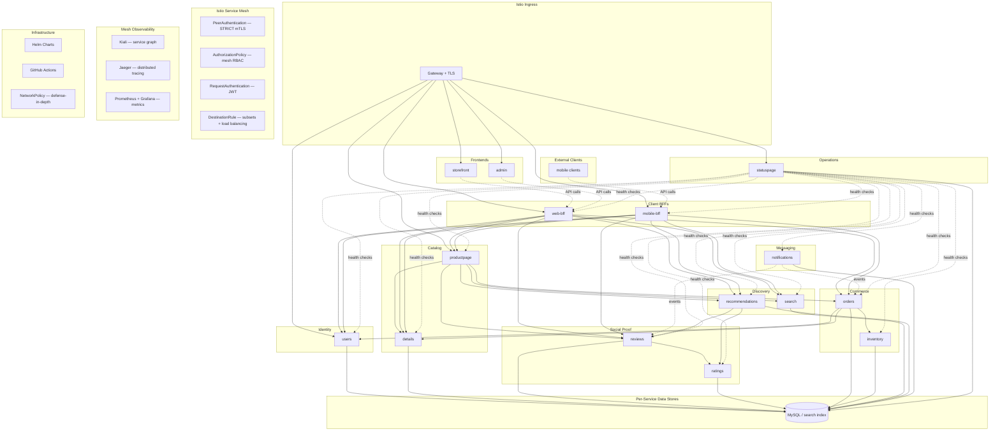

# Full Modernization Plan

Build a fifteen-service bookstore platform (thirteen Kotlin + Spring Boot backends and two Vue.js + TypeScript frontends) deployed on Istio service mesh with Helm charts, fix every security and code quality issue from the findings, and add a GitHub Actions CI/CD pipeline.

## Todos

| # | Phase | Task | Status |
|---|-------|------|--------|
| 1 | Phase 1 | Set up Gradle multi-module Kotlin project structure with version catalog, root build.gradle.kts, settings.gradle.kts | pending |
| 2 | Phase 2a | Rewrite details service in Kotlin Spring Boot (JPA, Actuator, HikariCP) | pending |
| 3 | Phase 2b | Rewrite ratings service in Kotlin Spring Boot | pending |
| 4 | Phase 2c | Rewrite reviews service in Kotlin Spring Boot (parameterized queries, validation, auth) | pending |
| 5 | Phase 2d | Rewrite productpage service in Kotlin Spring Boot (product aggregation, circuit breaker) | pending |
| 6 | Phase 2e | Create Flyway migration scripts from existing SQL schemas | pending |
| 7 | Phase 3 | Create multi-stage Dockerfiles for all services (Eclipse Temurin 21, non-root, health checks) | pending |
| 8 | Phase 4a | Write Kubernetes manifests (apps/v1, probes, resource limits, Secrets) | pending |
| 9 | Phase 4b | Write Kubernetes NetworkPolicy (defense-in-depth alongside Istio) | pending |
| 10 | Phase 4c | Create Helm chart with values overlays for local/production/cloud providers | pending |
| 11 | Phase 5a | Install Istio, configure PeerAuthentication (STRICT mTLS), DestinationRules | pending |
| 12 | Phase 5b | Configure Istio Gateway + VirtualService for ingress routing | pending |
| 13 | Phase 5c | Configure Istio AuthorizationPolicy for mesh-level access control | pending |
| 14 | Phase 6a | Configure traffic splitting (canary/weighted routing) via VirtualService | pending |
| 15 | Phase 6b | Configure fault injection (delays, HTTP errors) for resilience testing | pending |
| 16 | Phase 6c | Configure traffic mirroring for shadow testing | pending |
| 17 | Phase 6d | Configure ServiceEntry for egress control (external MySQL or external APIs) | pending |
| 18 | Phase 7 | Set up Kiali, Jaeger, Prometheus/Grafana with Istio telemetry integration | pending |
| 19 | Phase 8 | GitHub Actions workflows (CI: lint, test, build, scan; Deploy: push to GHCR, helm upgrade) | pending |
| 20 | Phase 9 | Remove legacy files, update README and docs, document Istio scenarios | pending |
| 21 | Phase 2f | `web-bff` and `mobile-bff` platform BFFs (see [jiraboard.md](jiraboard.md) BOOK-31): OpenAPI, Actuator, ProblemDetail; downstream aggregation + mesh routing | pending |

---

## Current State

A ~2017 IBM Code Pattern with 4 polyglot services (Ruby, Node.js, Java, Python), deprecated Istio Mixer telemetry, `extensions/v1beta1` Deployments, SQL injection vulnerabilities, committed secrets, EOL Docker images, and IBM Cloud vendor lock-in. See [findings.md](findings.md) for all 28 issues.

## Target State

Service topology matches [architecture.md](architecture.md) (the source of truth for runtime structure, including `storefront`, `admin`, `statuspage`, **`web-bff`**, and **`mobile-bff`**). Infrastructure, mesh, and observability layers shown below for modernization context.



---

## Phase 1: Project Structure & Build System

Restructure from flat files into a Gradle multi-module Kotlin project with shared configuration.

**New directory layout:**

```
microservices-traffic-management-using-istio/
├── build.gradle.kts
├── settings.gradle.kts
├── gradle/
│   └── libs.versions.toml
├── services/
│   ├── storefront/
│   │   ├── package.json
│   │   ├── vite.config.ts
│   │   ├── Dockerfile
│   │   └── src/...
│   ├── admin/
│   │   ├── package.json
│   │   ├── vite.config.ts
│   │   ├── Dockerfile
│   │   └── src/...
│   ├── productpage/
│   │   ├── build.gradle.kts
│   │   ├── Dockerfile
│   │   └── src/main/kotlin/...
│   ├── web-bff/
│   │   ├── build.gradle.kts
│   │   ├── Dockerfile
│   │   └── src/main/kotlin/...
│   ├── mobile-bff/
│   │   ├── build.gradle.kts
│   │   ├── Dockerfile
│   │   └── src/main/kotlin/...
│   ├── users/
│   ├── details/
│   ├── reviews/
│   ├── ratings/
│   ├── orders/
│   ├── inventory/
│   ├── notifications/
│   ├── search/
│   ├── recommendations/
│   └── statuspage/
├── helm/
│   └── bookinfo/
│       ├── Chart.yaml
│       ├── values.yaml
│       ├── templates/
│       │   ├── deployment.yaml
│       │   ├── service.yaml
│       │   ├── networkpolicy.yaml
│       │   ├── secret.yaml
│       │   └── mysql.yaml
│       ├── istio/
│       │   ├── gateway.yaml
│       │   ├── virtualservice.yaml
│       │   ├── destinationrule.yaml
│       │   ├── peerauthentication.yaml
│       │   ├── authorizationpolicy.yaml
│       │   └── serviceentry.yaml
│       └── values/
│           ├── local.yaml
│           ├── ibmcloud.yaml
│           └── gke.yaml
├── istio/
│   └── scenarios/
│       ├── canary-reviews-v2.yaml
│       ├── fault-inject-details-delay.yaml
│       ├── traffic-mirror-reviews.yaml
│       └── rate-limit-productpage.yaml
├── .github/
│   └── workflows/
│       ├── ci.yml
│       └── deploy.yml
├── db/
│   └── migrations/
│       └── V1__init_schema.sql
└── docs/
```

**Key decisions:**

- Kotlin 2.3.20, Spring Boot 4.0.5, Java 21 for backend services
- Vue.js 3 + TypeScript + Vite for the frontend SPAs
- Gradle version catalog (`libs.versions.toml`) for centralized dependency management (backend)
- Each backend service is a standalone Spring Boot app (own `main`, own Docker image)
- Each frontend is a standalone Vue.js app with its own `package.json`, Vite build, and Nginx Docker image
- Istio service mesh for mTLS, traffic management, observability, and policy
- `istio/scenarios/` directory holds example traffic configs that developers can apply to learn specific Istio patterns

---

## Phase 2: Implement all backend services in Kotlin + Spring Boot

Backend services are built in dependency order: catalog and social proof first, then identity, then product aggregation and platform BFF surfaces (`productpage` compatibility API, **`web-bff`**, **`mobile-bff`**), then commerce, discovery, messaging, and operations. The Vue.js frontends are built after the web BFF API surface stabilizes.

### 2a. details service

- Spring Boot Web MVC
- `GET /details` -- query `books` table via Spring Data JPA with parameterized queries
- Spring Boot Actuator (`/actuator/health`) with DB health indicator
- HikariCP connection pool

### 2b. ratings service

- `GET /ratings` -- query ratings via Spring Data JPA
- Actuator health
- No global mutable state; proper request-scoped DB access

### 2c. reviews service

- `GET /reviews` -- query reviews with pagination
- `POST /reviews` -- `@Valid` with Bean Validation (rating 1-5, reviewer length, review length)
- `DELETE /reviews` -- requires authorization (Spring Security + Istio AuthorizationPolicy)
- WebClient for calling ratings service with Resilience4j circuit breaker and tracing via Micrometer/OpenTelemetry
- JPA parameterized queries

### 2d. users service

- User accounts, authentication, session or token management
- Spring Security with JWT or OAuth2 resource-server patterns
- Per-service Flyway schema (database-per-service boundary)
- Istio `RequestAuthentication` integration documented

### 2e. productpage service (product aggregation)

- Aggregator that calls details, reviews, ratings, search, recommendations, orders
- Product-oriented JSON API retained for BookInfo-compatible flows and reusable by BFFs where appropriate
- Resilience4j circuit breakers per downstream; graceful degradation

### 2f. web-bff and mobile-bff (platform BFF APIs)

- Separate Spring Boot modules with distinct OpenAPI documents (SpringDoc); stable paths such as `/api/v1/web` and `/api/v1/mobile`
- `web-bff` serves web platforms, including `storefront` and `admin`; `mobile-bff` serves mobile clients
- Spring Boot Actuator (`/actuator/health`, Kubernetes probes), Micrometer metrics, global `ProblemDetail` error handling
- Downstream calls via WebClient or `RestClient` with explicit timeouts and Resilience4j once domain services are available
- Istio `VirtualService` routes and `AuthorizationPolicy` rows for ingress and mesh RBAC (see [architecture.md](architecture.md))

### 2g. orders service

- Order lifecycle, cart, checkout, fulfillment status
- Calls to details, inventory, and users for validation
- Saga or outbox pattern for multi-service coordination
- Idempotent create operations

### 2h. inventory service

- Stock levels, availability, reservation API
- Write-heavy with concurrency considerations
- Domain event publication when messaging infrastructure is present

### 2i. search service

- Full-text or faceted book search
- Search API backed by OpenSearch, Elasticsearch, or agreed embedded index
- Circuit breaking toward search backend

### 2j. recommendations service

- "Readers also liked" and related discovery
- Read-heavy with clear API contracts to productpage, web-bff, and mobile-bff
- Cache strategy for recommendation results

### 2k. notifications service

- Consumes domain events from orders and reviews
- Async consumer path via Kafka or RabbitMQ
- Egress to external SMTP, push, or third-party APIs

### 2l. statuspage service

- Aggregated health dashboard for all backend services
- Fan-out health checks to Actuator endpoints of all services
- Persistent incident and uptime history (own database)
- Public-facing status view independent of the main application

### 2m. storefront (Vue.js + TypeScript — customer-facing)

- Vue.js 3 SPA with TypeScript strict mode
- Vite build tooling, component-based architecture
- Consumes `web-bff` JSON API (customer endpoints)
- Pages: book catalog, product detail, reviews, search, cart, checkout, login
- Nginx-served static assets in a minimal Docker image
- Separate deployment; own Helm values and Istio VirtualService route

### 2n. admin (Vue.js + TypeScript — operator dashboard)

- Vue.js 3 SPA with TypeScript strict mode, same tech stack as storefront
- Consumes `web-bff` JSON API (admin-scoped endpoints)
- Pages: inventory management, review moderation, order management, service health overview
- Independently deployed on a separate path or hostname from storefront
- Nginx-served static assets in a minimal Docker image

### Cross-cutting for all backend services:

- Spring Boot Actuator for `/actuator/health`, `/actuator/readiness`, `/actuator/liveness`
- Micrometer + OpenTelemetry for distributed tracing (integrates with Istio sidecar tracing)
- Structured JSON logging via Logback
- Graceful shutdown support
- Flyway for DB schema migrations
- Database-per-service boundary (each service owns its schema)

---

## Phase 3: Docker Images

Replace all EOL base images with multi-stage builds:

```dockerfile
# Build stage
FROM eclipse-temurin:21-jdk AS build
WORKDIR /app
COPY . .
RUN ./gradlew :services:details:bootJar

# Runtime stage
FROM eclipse-temurin:21-jre-alpine
RUN addgroup -S app && adduser -S app -G app
USER app
COPY --from=build /app/services/details/build/libs/*.jar app.jar
EXPOSE 9080
ENTRYPOINT ["java", "-jar", "app.jar"]
```

- Non-root user in all images
- `.dockerignore` to exclude Gradle caches, `node_modules/`, `.git`, etc.
- Health check `HEALTHCHECK` directive
- Pin specific image digest tags
- Frontends: multi-stage Vite build + Nginx alpine runtime image (one per frontend)

---

## Phase 4: Kubernetes & Base Infrastructure

### 4a. Kubernetes resources (fix all deprecated APIs)

- `apps/v1` Deployments with `selector.matchLabels`
- Readiness probes: `httpGet /actuator/health/readiness`
- Liveness probes: `httpGet /actuator/health/liveness`
- Resource requests/limits on every container
- `PodDisruptionBudget` for each service
- Secrets via `ExternalSecret` (reference pattern) or `SealedSecret`
- ConfigMaps for non-sensitive config

### 4b. Kubernetes NetworkPolicy (defense-in-depth)

- Default-deny ingress policy per namespace
- Explicit allow rules matching the authorization matrix in [architecture.md](architecture.md)
- NetworkPolicy works alongside Istio AuthorizationPolicy as a second layer

### 4c. Helm chart

- Single `bookinfo` chart with per-service toggles
- `templates/` for Kubernetes workloads, `istio/` subdirectory for mesh resources
- `values.yaml` for defaults, `values/local.yaml` for kind/minikube, `values/production.yaml` for real clusters
- Support for `--set image.tag=` for CI-driven deployments

---

## Phase 5: Istio Service Mesh — Core

### 5a. Mesh installation and mTLS

- Istio installed via `istioctl install` (or Helm-based install for production)
- Namespace labeled with `istio-injection=enabled` for automatic sidecar injection
- `PeerAuthentication` with `STRICT` mode -- all service-to-service traffic encrypted via mTLS
- `DestinationRule` per service defining subsets (versions) and connection pool settings

### 5b. Ingress via Istio Gateway

- `Gateway` resource with TLS termination via cert-manager `Certificate`
- `VirtualService` for path-based routing to storefront, admin, web-bff, mobile-bff, and productpage compatibility routes
- Specific hostname binding (not wildcard `*`)

### 5c. Mesh-level authorization

- `AuthorizationPolicy` restricting which services can call which, matching the authorization matrix in [architecture.md](architecture.md)
- Default deny-all policy for the namespace
- Works alongside Spring Security endpoint-level authorization and Kubernetes NetworkPolicy

---

## Phase 6: Istio Service Mesh — Advanced Patterns

### 6a. Traffic splitting (canary deployments)

- `VirtualService` with weighted routing (e.g., 90% reviews-v1 / 10% reviews-v2)
- Header-based routing (e.g., user `jason` sees reviews-v2)
- Example configs in `istio/scenarios/` that developers can apply and study

### 6b. Fault injection

- `VirtualService` fault rules: inject 5s delay on details for 10% of requests
- `VirtualService` fault rules: inject HTTP 503 on ratings for 20% of requests
- Demonstrates how Resilience4j circuit breakers react to mesh-injected faults

### 6c. Traffic mirroring

- Mirror production traffic to reviews-v2 for shadow testing
- No impact on live users; new version receives a copy of real traffic

### 6d. Egress control

- `ServiceEntry` for controlled access to external services
- Default mesh policy: deny outbound traffic not explicitly allowed
- Example: external MySQL, external API endpoints

---

## Phase 7: Observability Stack

- **Kiali**: Mesh topology visualization, traffic flow, health status
- **Jaeger**: Distributed tracing across services (Istio sidecar + OpenTelemetry app traces)
- **Prometheus + Grafana**: Istio telemetry metrics + application-level Micrometer metrics, pre-built dashboards
- All deployed via Istio addons or Helm charts
- Documented: how to access dashboards, what to look for, how to correlate app traces with mesh traces

---

## Phase 8: CI/CD with GitHub Actions

### ci.yml (on every PR and push to main)

1. Lint Kotlin (detekt)
2. Run unit tests (`./gradlew test`)
3. Build Docker images
4. Run integration tests (Testcontainers with MySQL)
5. Scan images with Trivy
6. Helm lint (`helm lint helm/bookinfo`)

### deploy.yml (on tag or manual trigger)

1. Build and push images to GHCR (GitHub Container Registry)
2. Tag images with Git SHA
3. Deploy to target cluster via `helm upgrade --install`
4. Run smoke test (health check on `/actuator/health`)

---

## Phase 9: Documentation & Cleanup

- Replace the README with modern setup instructions (prerequisites, `kind create cluster`, `istioctl install`, `helm install`)
- Remove all legacy files (`.bluemix/`, `.travis.yml`, old `microservices/`, old root YAML, deprecated Istio Mixer CRDs)
- Document Istio scenarios in `istio/scenarios/` with README explaining each traffic pattern
- Update `findings.md` with resolution status
- Add `QUICKSTART.md` for getting running in 10 minutes with `kind` + Istio + Helm
- Keep `LICENSE` (Apache 2.0)

---

## What Gets Deleted

- `microservices/` (entire old source tree)
- `.bluemix/` (IBM Cloud toolchain)
- `.travis.yml`
- `scripts/install.sh`, `scripts/deploy-to-bluemix/`
- All root-level YAML files (`bookinfo.yaml`, `bookinfo-gateway.yaml`, `istio-gateway.yaml`, `book-database.yaml`, `details-new.yaml`, `reviews-new.yaml`, `ratings-new.yaml`, `node-port.yaml`, `mysql-egress.yaml`, `mysql-data.yaml`, `secrets.yaml`, `new-metrics-rule.yaml`)
- `GETTING_STARTED.md`, `MAINTAINERS.md`

## What Gets Created

- ~75+ new files across `services/`, `helm/`, `istio/`, `.github/`, `db/`
- Thirteen backend Spring Boot services, each with: `build.gradle.kts`, `Dockerfile`, `Application.kt`, controller, repository, model, config, tests
- Two frontend services (`storefront`, `admin`), each with: `package.json`, `vite.config.ts`, `Dockerfile`, Vue components, TypeScript source
- Helm chart: `Chart.yaml`, `values.yaml`, Kubernetes templates + Istio resource templates, overlay values files
- Istio scenarios: example traffic configs for canary, fault injection, mirroring, rate limiting
- GitHub Actions: 2 workflow files

---

## Execution Order

Phases 1-2 build all fifteen services (thirteen backends + two frontends). Phase 3 containerizes them. Phase 4 is Kubernetes infra. Phase 5 introduces Istio core (mTLS, gateway, authorization). Phase 6 adds advanced Istio patterns. Phase 7 wires up observability. Phase 8 depends on Phases 1-3 (needs buildable code). Phase 9 is cleanup after everything works.

Recommended service implementation order: **details** then **ratings** then **reviews** (catalog and social proof), then **users** (identity, needed before commerce), then **productpage** (product aggregation), then **web-bff** and **mobile-bff** (platform BFF APIs), then **storefront** and **admin** (Vue.js SPAs, after `web-bff` stabilizes), then **orders** and **inventory** (commerce), then **search** and **recommendations** (discovery), then **notifications** (messaging), then **statuspage** (operations, last because it health-checks all others).

---

## Findings Cross-Reference

Every finding from `findings.md` is addressed by this plan:

| Finding # | Issue | Resolved By |
|-----------|-------|-------------|
| 1 | SQL injection in reviews | Phase 2c -- Spring Data JPA parameterized queries |
| 2 | Destructive `/deleteReviews` without auth | Phase 2c -- Spring Security + Istio AuthorizationPolicy |
| 3 | Secrets committed to Git | Phase 4a -- ExternalSecret / SealedSecret |
| 4 | Hardcoded credentials in install script | Phase 9 -- script deleted, replaced by Helm values |
| 5 | No TLS termination | Phase 5b -- Istio Gateway with cert-manager TLS |
| 6 | Wildcard host matching | Phase 5b -- specific host in Istio Gateway/VirtualService |
| 7 | No NetworkPolicy or Istio RBAC | Phase 4b -- Kubernetes NetworkPolicy + Phase 5c -- Istio AuthorizationPolicy |
| 8 | MySQL root password in plain text | Phase 4a -- Secret reference, not inline env |
| 9 | Deprecated Mixer telemetry | Phase 9 -- removed entirely; observability via Phase 7 (Istio telemetry v2 + Micrometer/OpenTelemetry) |
| 10 | Deprecated `extensions/v1beta1` | Phase 4a -- `apps/v1` |
| 11 | EOL base images | Phase 3 -- Eclipse Temurin 21 |
| 12 | Outdated dependencies | Phase 1 -- Gradle version catalog, current deps |
| 13 | Legacy IBM Cloud CLI | Phase 9 -- scripts deleted |
| 14 | Duplicated YAML block | Phase 9 -- `new-metrics-rule.yaml` deleted entirely |
| 15 | Database connection leaks | Phase 2 -- HikariCP connection pool via Spring |
| 16 | Global mutable state (ratings.js) | Phase 2b -- request-scoped Spring beans |
| 17 | Hardcoded array size (reviews) | Phase 2c -- dynamic list with pagination |
| 18 | Health checks don't verify DB | Phase 2 -- Actuator DB health indicator |
| 19 | No input validation | Phase 2c -- Bean Validation (`@Valid`) |
| 20 | No readiness/liveness probes in YAML | Phase 4a -- Actuator endpoints wired to probes |
| 21 | No resource limits | Phase 4a -- requests/limits on all containers |
| 22 | No HPA | Phase 4a/4c -- HPA template in Helm chart |
| 23 | Manual sidecar injection | Phase 5a -- automatic injection via namespace label |
| 24 | Missing `images/` directory | Phase 9 -- README rewritten, no dangling refs |
| 25 | Travis CI deploy-and-destroy | Phase 8 -- GitHub Actions with proper test stages |
| 26 | Two conflicting gateway files | Phase 5b -- single Istio Gateway resource in Helm template |
| 27 | secrets.yaml base64 mismatch with sed | Phase 4a -- no more sed patching, Helm values |
| 28 | Inconsistent env var naming | Phase 2 -- Spring Boot `application.yml` config |
