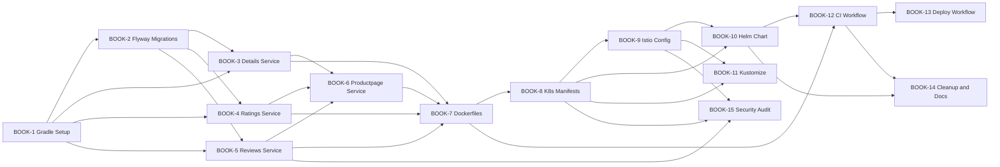

# BookInfo Modernization -- Ticket Board

## Epic: BOOK-0 -- Full Modernization

Rewrite the BookInfo microservices platform from a deprecated 2017 IBM Code Pattern into a production-grade Kotlin + Spring Boot reference architecture with modern Istio, Helm, Kustomize, and GitHub Actions CI/CD.

---

## Sprint 1: Foundation

### BOOK-1 -- Initialize Gradle multi-module project structure

**Type:** Task
**Priority:** Highest
**Story Points:** 3
**Labels:** `foundation`, `build-system`
**Blocks:** BOOK-2, BOOK-3, BOOK-4, BOOK-5, BOOK-6, BOOK-7

**Description:**
Create the root `build.gradle.kts`, `settings.gradle.kts`, and `gradle/libs.versions.toml` version catalog. Define shared configuration (Kotlin 2.0+, Java 21, Spring Boot 3.3+, common dependencies, detekt, JaCoCo). Create empty module directories under `services/` for productpage, details, reviews, and ratings, each with their own `build.gradle.kts`.

**Acceptance Criteria:**
- `./gradlew build` succeeds from root
- Version catalog defines all shared dependency versions
- Each service module is included in `settings.gradle.kts`
- Detekt and JaCoCo plugins configured at root level
- `.gitignore` updated for Gradle build outputs

---

### BOOK-2 -- Create Flyway database migration scripts

**Type:** Task
**Priority:** High
**Story Points:** 2
**Labels:** `foundation`, `database`
**Blocked By:** BOOK-1

**Description:**
Convert the existing `bookinfo.sql` schema into a Flyway migration file at `db/migrations/V1__init_schema.sql`. Define `books` and `reviews` tables with proper types, constraints, and seed data. All services will share this migration path.

**Acceptance Criteria:**
- `V1__init_schema.sql` creates both tables with primary keys, NOT NULL constraints, and AUTO_INCREMENT
- Seed data matches the original `bookinfo.sql` content
- Migration runs successfully against MySQL 8.4

---

## Sprint 2: Service Rewrites

### BOOK-3 -- Rewrite details service in Kotlin + Spring Boot

**Type:** Story
**Priority:** High
**Story Points:** 3
**Labels:** `service`, `kotlin`, `details`
**Blocked By:** BOOK-1, BOOK-2

**Description:**
Rewrite the Ruby WEBrick `details.rb` service as a Kotlin Spring Boot application.

**Endpoints:**
- `GET /details` -- returns book details from the `books` table
- Health/readiness/liveness via Spring Boot Actuator

**Technical Requirements:**
- Spring Data JPA with HikariCP connection pool
- Parameterized queries (no string concatenation)
- Actuator health endpoint includes database health indicator
- Structured JSON logging via Logback
- `application.yml` with externalized config (DB host, port, credentials via env vars)
- Graceful shutdown enabled
- Unit tests for controller and repository layers

**Acceptance Criteria:**
- `./gradlew :services:details:test` passes
- Service starts and responds on port 9080
- `/details` returns JSON matching the original schema
- `/actuator/health` shows `UP` with DB status
- No connection leaks under repeated requests

---

### BOOK-4 -- Rewrite ratings service in Kotlin + Spring Boot

**Type:** Story
**Priority:** High
**Story Points:** 3
**Labels:** `service`, `kotlin`, `ratings`
**Blocked By:** BOOK-1, BOOK-2

**Description:**
Rewrite the Node.js `ratings.js` service as a Kotlin Spring Boot application. Eliminates the global mutable state and async race conditions from the original.

**Endpoints:**
- `GET /ratings` -- returns ratings from the `reviews` table
- Health/readiness/liveness via Actuator

**Technical Requirements:**
- Spring Data JPA with request-scoped data access
- No module-level mutable state
- Returns proper JSON response (not dependent on previous request state)
- Unit tests

**Acceptance Criteria:**
- `./gradlew :services:ratings:test` passes
- Concurrent requests return correct, independent results
- `/ratings` returns JSON with reviewer ratings
- `/actuator/health` shows `UP` with DB status

---

### BOOK-5 -- Rewrite reviews service in Kotlin + Spring Boot

**Type:** Story
**Priority:** Highest
**Story Points:** 5
**Labels:** `service`, `kotlin`, `reviews`, `security`
**Blocked By:** BOOK-1, BOOK-2

**Description:**
Rewrite the Java/Open Liberty reviews service. This is the most complex service and contains the critical SQL injection vulnerability (Finding #1) and unprotected destructive endpoint (Finding #2).

**Endpoints:**
- `GET /reviews` -- paginated list of reviews for a book
- `POST /reviews` -- create a new review (with input validation)
- `DELETE /reviews` -- delete all reviews (requires authorization)
- `GET /ratings` (internal call to ratings service via WebClient)
- Health/readiness/liveness via Actuator

**Technical Requirements:**
- Spring Data JPA with parameterized queries (fixes SQL injection)
- Bean Validation (`@Valid`) on POST body: rating 1-5, reviewer max 40 chars, review max 1000 chars
- `DELETE /reviews` requires an authorization header or role check
- WebClient for calling ratings service with timeout configuration
- Istio tracing headers propagated automatically via Micrometer/OpenTelemetry
- Pagination support (not hard-capped at 5 results)
- JDBC Connection and Statement properly closed (try-with-resources via JPA)
- Unit tests for all endpoints including validation failure cases

**Acceptance Criteria:**
- `./gradlew :services:reviews:test` passes
- SQL injection payloads in reviewer/review/rating fields are safely handled
- `POST /reviews` with rating=6 returns 400
- `POST /reviews` with valid data returns 201
- `DELETE /reviews` without auth returns 403
- `/reviews` with >5 reviews returns paginated results
- No connection leaks

---

### BOOK-6 -- Rewrite productpage service in Kotlin + Spring Boot

**Type:** Story
**Priority:** High
**Story Points:** 5
**Labels:** `service`, `kotlin`, `productpage`
**Blocked By:** BOOK-3, BOOK-4, BOOK-5

**Description:**
Create the productpage aggregator/BFF service. The original was a pre-built Python image with no source in the repo. This is now a proper Kotlin service that aggregates data from details, reviews, and ratings.

**Endpoints:**
- `GET /productpage` -- renders full page with book details, reviews, and ratings
- `GET /api/v1/products` -- JSON API for product data
- `GET /login`, `GET /logout` -- basic session handling
- Health/readiness/liveness via Actuator

**Technical Requirements:**
- WebClient calls to details, reviews, and ratings services
- Resilience4j circuit breaker on each downstream call
- Graceful degradation: page still renders if reviews or ratings are down
- Thymeleaf server-side rendering for the product page
- Timeout configuration per downstream service
- Unit tests with WireMock for downstream service mocking

**Acceptance Criteria:**
- `./gradlew :services:productpage:test` passes
- Page renders with all sections when all services are up
- Page renders with "ratings unavailable" when ratings is down (circuit breaker open)
- Page renders with "reviews unavailable" when reviews is down
- Response time degrades gracefully, not catastrophically, when downstream is slow

---

## Sprint 3: Containers & Infrastructure

### BOOK-7 -- Create multi-stage Dockerfiles for all services

**Type:** Task
**Priority:** High
**Story Points:** 3
**Labels:** `docker`, `containers`
**Blocked By:** BOOK-3, BOOK-4, BOOK-5, BOOK-6

**Description:**
Create production-ready Dockerfiles for each service using multi-stage builds.

**Technical Requirements:**
- Build stage: `eclipse-temurin:21-jdk`
- Runtime stage: `eclipse-temurin:21-jre-alpine`
- Non-root user (`app:app`) in runtime stage
- `HEALTHCHECK` directive pointing to `/actuator/health`
- `.dockerignore` excluding `.git/`, `build/`, `.gradle/`, `*.md`
- All images expose port 9080
- Images tagged with `bookinfo/<service>:<version>`

**Acceptance Criteria:**
- `docker build` succeeds for all 4 services
- Containers start and pass health check
- Running as non-root verified (`docker exec <id> whoami` returns `app`)
- Image size is reasonable (<300MB per service)
- No CVEs above MEDIUM in `trivy image` scan

---

### BOOK-8 -- Write modern Kubernetes manifests

**Type:** Story
**Priority:** High
**Story Points:** 5
**Labels:** `kubernetes`, `infrastructure`
**Blocked By:** BOOK-7

**Description:**
Create Kubernetes resource manifests that address findings #10, #20, #21, #22, #23, #27, #28.

**Resources per service:**
- Deployment (`apps/v1`) with readiness/liveness probes, resource requests/limits, and `version` label
- Service (ClusterIP, port 9080)
- HorizontalPodAutoscaler (min 1, max 5, CPU target 70%)
- PodDisruptionBudget (minAvailable 1)

**Database resources:**
- StatefulSet for MySQL 8.4
- Service (ClusterIP, port 3306)
- Secret (template reference, not hardcoded values)
- ConfigMap for MySQL configuration

**Namespace:**
- Namespace `bookinfo` with label `istio-injection: enabled` (automatic sidecar injection)

**Acceptance Criteria:**
- All resources use `apps/v1` API version
- Every container has readiness and liveness probes configured
- Every container has resource requests and limits
- No secrets contain hardcoded values (template placeholders only)
- `kubectl apply --dry-run=client -f k8s/base/` succeeds
- Environment variables consistently named via ConfigMap/Secret references

---

### BOOK-9 -- Write modern Istio service mesh configuration

**Type:** Story
**Priority:** High
**Story Points:** 5
**Labels:** `istio`, `service-mesh`, `security`
**Blocked By:** BOOK-8

**Description:**
Create Istio resources that address findings #5, #6, #7, #9, #14, #26. Replace all deprecated Mixer configuration with current Istio APIs.

**Resources:**
- `Gateway` -- TLS termination on port 443 (with cert-manager annotation), HTTP-to-HTTPS redirect on port 80, specific hostname (not wildcard)
- `VirtualService` -- path-based routing to productpage (single VirtualService, resolves the two-file conflict)
- `DestinationRule` (per service) -- STRICT mTLS, connection pool limits, outlier detection (circuit breaking at mesh level)
- `PeerAuthentication` -- mesh-wide STRICT mTLS mode
- `AuthorizationPolicy` -- productpage can call details, reviews, ratings; reviews can call ratings; no other cross-service calls allowed; deny-all default
- `ServiceEntry` -- external MySQL access with TLS origination (optional, for external DB mode)
- No Mixer resources (`config.istio.io/v1alpha2` removed entirely)

**Acceptance Criteria:**
- `istioctl analyze` reports no warnings or errors
- All resources use `networking.istio.io/v1beta1` or `security.istio.io/v1beta1` API versions
- mTLS enforced between all services
- Unauthorized service-to-service calls are denied (e.g., details cannot call reviews)
- Gateway serves HTTPS with valid TLS config
- No `config.istio.io` resources remain

---

### BOOK-10 -- Create Helm chart with multi-cloud overlays

**Type:** Story
**Priority:** High
**Story Points:** 5
**Labels:** `helm`, `infrastructure`, `multi-cloud`
**Blocked By:** BOOK-8, BOOK-9

**Description:**
Package all Kubernetes and Istio resources into a Helm 3 chart under `helm/bookinfo/`.

**Structure:**
- `Chart.yaml` with chart metadata and version
- `values.yaml` with sane defaults (image tags, replica counts, resource limits, feature flags)
- Templates for all resources from BOOK-8 and BOOK-9
- `values/local.yaml` -- NodePort ingress, no TLS, reduced resource limits, single replica
- `values/production.yaml` -- LoadBalancer, TLS enabled, production resource limits, HPA enabled
- `values/gke.yaml` -- GKE-specific annotations (NEG, IAP)
- `values/ibmcloud.yaml` -- IBM Cloud-specific annotations

**Acceptance Criteria:**
- `helm lint helm/bookinfo` passes
- `helm template bookinfo helm/bookinfo` renders valid YAML
- `helm install bookinfo helm/bookinfo -f helm/bookinfo/values/local.yaml` deploys to a local kind cluster
- `--set image.tag=abc123` overrides all service image tags
- Each service can be individually disabled via `services.<name>.enabled: false`

---

### BOOK-11 -- Create Kustomize base and overlays

**Type:** Task
**Priority:** Medium
**Story Points:** 3
**Labels:** `kustomize`, `infrastructure`
**Blocked By:** BOOK-8, BOOK-9

**Description:**
Provide a Kustomize alternative for users who prefer `kubectl apply -k` over Helm.

**Structure:**
- `k8s/base/kustomization.yaml` referencing all base resources
- `k8s/overlays/local/kustomization.yaml` with patches for local development
- `k8s/overlays/production/kustomization.yaml` with patches for production

**Acceptance Criteria:**
- `kubectl apply -k k8s/overlays/local/ --dry-run=client` succeeds
- `kubectl apply -k k8s/overlays/production/ --dry-run=client` succeeds
- Local overlay reduces resource limits and uses NodePort
- Production overlay enables TLS and sets production resource limits

---

## Sprint 4: CI/CD & Polish

### BOOK-12 -- Create GitHub Actions CI workflow

**Type:** Story
**Priority:** High
**Story Points:** 3
**Labels:** `cicd`, `github-actions`
**Blocked By:** BOOK-7, BOOK-10

**Description:**
Create `.github/workflows/ci.yml` that runs on every PR and push to `main`.

**Pipeline Steps:**
1. Checkout code
2. Set up Java 21 + Gradle cache
3. Run detekt lint (`./gradlew detekt`)
4. Run unit tests (`./gradlew test`)
5. Build Docker images (docker buildx)
6. Run integration tests with Testcontainers + MySQL
7. Scan images with Trivy (fail on HIGH/CRITICAL)
8. Lint Helm chart (`helm lint helm/bookinfo`)
9. Validate Kustomize (`kubectl kustomize k8s/overlays/local/`)

**Acceptance Criteria:**
- Workflow triggers on PR and push to main
- All steps run and pass on a clean checkout
- Trivy scan fails the pipeline if HIGH/CRITICAL CVEs found
- Test results published as PR check annotations
- Gradle build cache reduces subsequent run times

---

### BOOK-13 -- Create GitHub Actions deploy workflow

**Type:** Story
**Priority:** Medium
**Story Points:** 3
**Labels:** `cicd`, `github-actions`, `deployment`
**Blocked By:** BOOK-12

**Description:**
Create `.github/workflows/deploy.yml` that runs on tag push or manual `workflow_dispatch`.

**Pipeline Steps:**
1. Build all service Docker images
2. Tag with Git SHA and semver tag
3. Push to GHCR (`ghcr.io/<owner>/bookinfo/<service>:<tag>`)
4. Deploy to target cluster via `helm upgrade --install` (cluster credentials via GitHub Secrets)
5. Run smoke test (`curl /actuator/health` on each service)

**Acceptance Criteria:**
- Images pushed to GHCR with correct tags
- Helm deploy uses `--set image.tag=<sha>` for immutable deploys
- Smoke test verifies all services are healthy
- Manual trigger allows selecting target environment (staging/production)
- Workflow uses OIDC for cloud authentication (no long-lived credentials)

---

### BOOK-14 -- Remove legacy files and update documentation

**Type:** Task
**Priority:** Medium
**Story Points:** 2
**Labels:** `cleanup`, `documentation`
**Blocked By:** BOOK-10, BOOK-12

**Description:**
Remove all legacy artifacts and create modern documentation.

**Delete:**
- `microservices/` directory
- `.bluemix/` directory
- `.travis.yml`
- `scripts/` directory
- All root-level YAML files (bookinfo.yaml, bookinfo-gateway.yaml, istio-gateway.yaml, book-database.yaml, details-new.yaml, reviews-new.yaml, ratings-new.yaml, node-port.yaml, mysql-egress.yaml, mysql-data.yaml, secrets.yaml, new-metrics-rule.yaml)
- `GETTING_STARTED.md`, `GETTING_STARTED-ko.md`, `README-ko.md`, `MAINTAINERS.md`, `CONTRIBUTING.md`

**Create/Update:**
- `README.md` -- new project overview, architecture diagram, prerequisites, quick start
- `QUICKSTART.md` -- 5-minute setup with kind + istioctl + helm
- Update `findings.md` with resolution status column

**Acceptance Criteria:**
- No legacy files remain
- README has working quick start instructions
- All links in documentation are valid (no dead references to `images/` directory)
- `findings.md` shows all 28 findings as resolved with ticket references

---

### BOOK-15 -- Security hardening audit

**Type:** Task
**Priority:** High
**Story Points:** 2
**Labels:** `security`, `audit`
**Blocked By:** BOOK-5, BOOK-8, BOOK-9

**Description:**
Final security verification that all critical findings are resolved.

**Verification Checklist:**
- [ ] SQL injection: attempt injection payloads against `POST /reviews` -- all safely rejected
- [ ] `DELETE /reviews` without auth returns 403
- [ ] No secrets in Git history (note: historical secrets remain in old commits; document this)
- [ ] All inter-service traffic encrypted (mTLS verified via `istioctl proxy-status`)
- [ ] Unauthorized service calls denied (e.g., `curl` from details pod to reviews returns 403)
- [ ] Container images run as non-root
- [ ] Trivy scan shows no HIGH/CRITICAL CVEs
- [ ] No `config.istio.io` resources in any manifest

**Acceptance Criteria:**
- All checklist items pass
- Security findings documented as resolved in `findings.md`

---

## Board Summary

| Sprint | Tickets | Total Story Points |
|--------|---------|-------------------|
| Sprint 1: Foundation | BOOK-1, BOOK-2 | 5 |
| Sprint 2: Service Rewrites | BOOK-3, BOOK-4, BOOK-5, BOOK-6 | 16 |
| Sprint 3: Containers & Infrastructure | BOOK-7, BOOK-8, BOOK-9, BOOK-10, BOOK-11 | 21 |
| Sprint 4: CI/CD & Polish | BOOK-12, BOOK-13, BOOK-14, BOOK-15 | 10 |
| **Total** | **15 tickets** | **52 points** |

## Dependency Graph

## Parallelization Opportunities

- **BOOK-3, BOOK-4, BOOK-5** can be developed in parallel (independent services, same dependencies)
- **BOOK-8 + BOOK-9** (infra) can start as soon as BOOK-7 is done, independent of service code changes
- **BOOK-11** (Kustomize) can be done in parallel with **BOOK-10** (Helm) since they're alternative packaging of the same resources
- **BOOK-12** and **BOOK-13** are sequential (deploy depends on CI)
