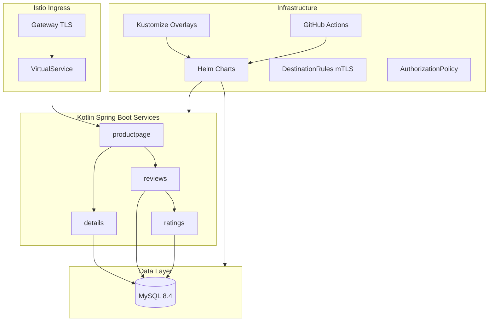

# Full Modernization Plan

Full production-grade modernization: rewrite all microservices in Kotlin + Spring Boot, upgrade all Kubernetes and Istio manifests to current APIs, introduce Helm charts with Kustomize overlays for multi-cloud support, fix every security and code quality issue from the findings, and add a GitHub Actions CI/CD pipeline.

## Todos

| # | Phase | Task | Status |
|---|-------|------|--------|
| 1 | Phase 1 | Set up Gradle multi-module Kotlin project structure with version catalog, root build.gradle.kts, settings.gradle.kts | pending |
| 2 | Phase 2a | Rewrite details service in Kotlin Spring Boot (JPA, Actuator, HikariCP) | pending |
| 3 | Phase 2b | Rewrite ratings service in Kotlin Spring Boot | pending |
| 4 | Phase 2c | Rewrite reviews service in Kotlin Spring Boot (parameterized queries, validation, auth) | pending |
| 5 | Phase 2d | Rewrite productpage service in Kotlin Spring Boot (aggregator/BFF, circuit breaker) | pending |
| 6 | Phase 2e | Create Flyway migration scripts from existing SQL schemas | pending |
| 7 | Phase 3 | Create multi-stage Dockerfiles for all services (Eclipse Temurin 21, non-root, health checks) | pending |
| 8 | Phase 4a | Write modern Kubernetes manifests (apps/v1, probes, resource limits, ExternalSecrets) | pending |
| 9 | Phase 4b | Write modern Istio config (Gateway TLS, DestinationRule mTLS, AuthorizationPolicy, PeerAuthentication) | pending |
| 10 | Phase 4c | Create Helm chart with values overlays for local/production/cloud providers | pending |
| 11 | Phase 4d | Create Kustomize base + overlays as alternative to Helm | pending |
| 12 | Phase 5 | GitHub Actions workflows (CI: lint, test, build, scan; Deploy: push to GHCR, helm upgrade) | pending |
| 13 | Phase 6 | Remove legacy files (.bluemix, .travis.yml, old microservices/, old YAML), update README and docs | pending |

---

## Current State

A ~2017 IBM Code Pattern with 4 polyglot services (Ruby, Node.js, Java, Python), deprecated Istio Mixer telemetry, `extensions/v1beta1` Deployments, SQL injection vulnerabilities, committed secrets, EOL Docker images, and IBM Cloud vendor lock-in. See [findings.md](findings.md) for all 28 issues.

## Target State



---

## Phase 1: Project Structure & Build System

Restructure from flat files into a Gradle multi-module Kotlin project with shared configuration.

**New directory layout:**

```
microservices-traffic-management-using-istio/
├── build.gradle.kts                     # Root build with shared config
├── settings.gradle.kts                  # Module includes
├── gradle/
│   └── libs.versions.toml               # Version catalog
├── services/
│   ├── productpage/                     # Kotlin Spring Boot module
│   │   ├── build.gradle.kts
│   │   ├── Dockerfile
│   │   └── src/main/kotlin/...
│   ├── details/                         # Kotlin Spring Boot module
│   ├── reviews/                         # Kotlin Spring Boot module
│   └── ratings/                         # Kotlin Spring Boot module
├── helm/
│   └── bookinfo/
│       ├── Chart.yaml
│       ├── values.yaml
│       ├── templates/
│       │   ├── deployment.yaml          # Parameterized per-service
│       │   ├── service.yaml
│       │   ├── gateway.yaml
│       │   ├── virtualservice.yaml
│       │   ├── destinationrule.yaml
│       │   ├── authorizationpolicy.yaml
│       │   ├── peerauthentication.yaml
│       │   ├── secret.yaml              # ExternalSecret reference
│       │   └── mysql.yaml
│       └── values/                      # Kustomize-style overlays
│           ├── local.yaml               # minikube/kind
│           ├── ibmcloud.yaml
│           └── gke.yaml
├── .github/
│   └── workflows/
│       ├── ci.yml
│       └── deploy.yml
├── k8s/                                 # Raw YAML kept for kubectl users
│   ├── base/
│   └── overlays/
│       ├── local/
│       └── production/
├── db/
│   └── migrations/
│       └── V1__init_schema.sql          # Flyway migration
├── docs/
└── findings.md
```

**Key decisions:**

- Kotlin 2.0+, Spring Boot 3.3+, Java 21 (GraalVM-compatible)
- Gradle version catalog (`libs.versions.toml`) for centralized dependency management
- Each service is a standalone Spring Boot app (own `main`, own Docker image)
- Shared code (DB models, health patterns) extracted into a `common` module if needed

---

## Phase 2: Rewrite Microservices in Kotlin + Spring Boot

### 2a. details service (replaces `microservices/details/details.rb`)

- Spring Boot WebFlux (reactive) or Web MVC
- `GET /details` -- query `books` table via Spring Data JPA with parameterized queries
- `GET /health` -- Spring Boot Actuator (`/actuator/health`) with DB health indicator
- HikariCP connection pool (replaces per-request connection creation)

### 2b. ratings service (replaces `microservices/ratings/ratings.js`)

- `GET /ratings` -- query `reviews` table for ratings via Spring Data JPA
- `GET /health` -- Actuator
- No global mutable state; proper request-scoped DB access

### 2c. reviews service (replaces `microservices/reviews/`)

- `GET /reviews` -- query reviews with pagination (not hard-capped at 5)
- `POST /reviews` -- replaces `/postReview`, uses `@Valid` with Bean Validation (rating 1-5, reviewer length, review length)
- `DELETE /reviews` -- requires authorization (not open to anonymous)
- WebClient for calling ratings service (replaces raw JAX-RS client), with proper tracing header propagation via Micrometer/OpenTelemetry
- `PreparedStatement` via JPA (fixes SQL injection)

### 2d. productpage service (replaces `journeycode/productpage-orig`)

- Aggregator/BFF that calls details, reviews, ratings
- Serves the frontend HTML (Thymeleaf or serves a static SPA)
- Resilience4j circuit breaker for downstream calls

### Cross-cutting for all services:

- Spring Boot Actuator for `/actuator/health`, `/actuator/readiness`, `/actuator/liveness`
- Micrometer + OpenTelemetry for distributed tracing (replaces Mixer/Zipkin)
- Structured JSON logging via Logback
- Graceful shutdown support
- Flyway for DB schema migrations (replaces raw SQL init scripts)

---

## Phase 3: Docker Images

Replace all EOL base images with multi-stage builds:

```dockerfile
# Build stage
FROM eclipse-temurin:21-jdk AS build
WORKDIR /app
COPY . .
RUN ./gradlew :services:details:bootJar

# Runtime stage
FROM eclipse-temurin:21-jre-alpine
RUN addgroup -S app && adduser -S app -G app
USER app
COPY --from=build /app/services/details/build/libs/*.jar app.jar
EXPOSE 9080
ENTRYPOINT ["java", "-jar", "app.jar"]
```

- Non-root user in all images
- `.dockerignore` to exclude Gradle caches, `.git`, etc.
- Health check `HEALTHCHECK` directive
- Pin specific image digest tags

---

## Phase 4: Kubernetes & Istio Manifests

### 4a. Kubernetes resources (fix all deprecated APIs)

- `apps/v1` Deployments with `selector.matchLabels`
- Readiness probes: `httpGet /actuator/health/readiness`
- Liveness probes: `httpGet /actuator/health/liveness`
- Resource requests/limits on every container
- `PodDisruptionBudget` for each service
- Secrets via `ExternalSecret` (reference pattern) or `SealedSecret` -- never plain base64 in Git
- ConfigMaps for non-sensitive config

### 4b. Istio resources (replace all deprecated Mixer config)

- **Gateway**: TLS termination with cert-manager or manual cert reference
- **VirtualService**: Proper route matching with specific hosts (not wildcard)
- **DestinationRule**: STRICT mTLS between all services, connection pool settings, outlier detection (circuit breaking)
- **PeerAuthentication**: Mesh-wide STRICT mTLS
- **AuthorizationPolicy**: Restrict which services can talk to which (e.g., only reviews can call ratings)
- **ServiceEntry**: Retained for external MySQL (if used), with TLS origination
- Remove `new-metrics-rule.yaml` entirely -- telemetry is now Envoy-native via `Telemetry` API

### 4c. Helm chart

- Single `bookinfo` chart with per-service toggles
- `values.yaml` for defaults, `values/local.yaml` for minikube (NodePort, no TLS), `values/production.yaml` for real clusters (LoadBalancer, TLS, resource limits)
- Support for `--set image.tag=` for CI-driven deployments

### 4d. Kustomize alternative

- `k8s/base/` with raw YAML
- `k8s/overlays/local/` and `k8s/overlays/production/` with patches
- For users who prefer `kubectl apply -k` over Helm

---

## Phase 5: CI/CD with GitHub Actions

### ci.yml (on every PR and push to main)

1. Lint Kotlin (detekt)
2. Run unit tests (`./gradlew test`)
3. Build Docker images
4. Run integration tests (Testcontainers with MySQL)
5. Scan images with Trivy
6. Helm lint (`helm lint helm/bookinfo`)

### deploy.yml (on tag or manual trigger)

1. Build and push images to GHCR (GitHub Container Registry)
2. Tag images with Git SHA
3. Deploy to target cluster via `helm upgrade --install`
4. Run smoke test (health check on `/actuator/health`)

---

## Phase 6: Documentation & Cleanup

- Replace the README with modern setup instructions (prerequisites, `kind create cluster`, `istioctl install`, `helm install`)
- Remove all IBM Cloud / Bluemix specific files (`.bluemix/`, `scripts/deploy-to-bluemix/`)
- Remove `.travis.yml`
- Remove the old `microservices/` directory
- Update `findings.md` with resolution status
- Add `QUICKSTART.md` for getting running in 5 minutes with `kind` + `istioctl` + `helm`
- Keep `LICENSE` (Apache 2.0)

---

## What Gets Deleted

- `microservices/` (entire old source tree)
- `.bluemix/` (IBM Cloud toolchain)
- `.travis.yml`
- `scripts/install.sh`, `scripts/deploy-to-bluemix/`
- All root-level YAML files (`bookinfo.yaml`, `bookinfo-gateway.yaml`, `istio-gateway.yaml`, `book-database.yaml`, `details-new.yaml`, `reviews-new.yaml`, `ratings-new.yaml`, `node-port.yaml`, `mysql-egress.yaml`, `mysql-data.yaml`, `secrets.yaml`, `new-metrics-rule.yaml`)
- `GETTING_STARTED.md`, `GETTING_STARTED-ko.md`, `README-ko.md`, `MAINTAINERS.md`

## What Gets Created

- ~20 new files across `services/`, `helm/`, `.github/`, `db/`, `k8s/`
- Each service: `build.gradle.kts`, `Dockerfile`, `Application.kt`, controller, repository, model, config, tests
- Helm chart: `Chart.yaml`, `values.yaml`, 8-10 templates, overlay values files
- GitHub Actions: 2 workflow files

---

## Execution Order

Phases 1-3 are the core rewrite and can be done incrementally (one service at a time). Phase 4 can proceed in parallel since it's infra YAML. Phase 5 depends on Phases 1-3 (needs buildable code). Phase 6 is cleanup after everything works.

Recommended service rewrite order: **details** (simplest, one endpoint) then **ratings** then **reviews** (most complex, has the SQL injection fix) then **productpage** (aggregator, depends on the others).

---

## Findings Cross-Reference

Every finding from `findings.md` is addressed by this plan:

| Finding # | Issue | Resolved By |
|-----------|-------|-------------|
| 1 | SQL injection in reviews | Phase 2c -- Spring Data JPA parameterized queries |
| 2 | Destructive `/deleteReviews` without auth | Phase 2c -- authorization required |
| 3 | Secrets committed to Git | Phase 4a -- ExternalSecret / SealedSecret |
| 4 | Hardcoded credentials in install script | Phase 6 -- script deleted, replaced by Helm values |
| 5 | No TLS termination | Phase 4b -- Gateway with TLS |
| 6 | Wildcard host matching | Phase 4b -- specific host in Gateway/VirtualService |
| 7 | No NetworkPolicy or Istio RBAC | Phase 4b -- AuthorizationPolicy + PeerAuthentication |
| 8 | MySQL root password in plain text | Phase 4a -- Secret reference, not inline env |
| 9 | Deprecated Mixer telemetry | Phase 4b -- removed, Envoy-native telemetry |
| 10 | Deprecated `extensions/v1beta1` | Phase 4a -- `apps/v1` |
| 11 | EOL base images | Phase 3 -- Eclipse Temurin 21 |
| 12 | Outdated dependencies | Phase 1 -- Gradle version catalog, current deps |
| 13 | Legacy IBM Cloud CLI | Phase 6 -- scripts deleted |
| 14 | Duplicated YAML block | Phase 4b -- `new-metrics-rule.yaml` deleted entirely |
| 15 | Database connection leaks | Phase 2 -- HikariCP connection pool via Spring |
| 16 | Global mutable state (ratings.js) | Phase 2b -- request-scoped Spring beans |
| 17 | Hardcoded array size (reviews) | Phase 2c -- dynamic list with pagination |
| 18 | Health checks don't verify DB | Phase 2 -- Actuator DB health indicator |
| 19 | No input validation | Phase 2c -- Bean Validation (`@Valid`) |
| 20 | No readiness/liveness probes in YAML | Phase 4a -- Actuator endpoints wired to probes |
| 21 | No resource limits | Phase 4a -- requests/limits on all containers |
| 22 | No HPA | Phase 4a/4c -- HPA template in Helm chart |
| 23 | Manual sidecar injection | Phase 4a -- namespace label `istio-injection=enabled` |
| 24 | Missing `images/` directory | Phase 6 -- README rewritten, no dangling refs |
| 25 | Travis CI deploy-and-destroy | Phase 5 -- GitHub Actions with proper test stages |
| 26 | Two conflicting gateway files | Phase 4b -- single Gateway in Helm template |
| 27 | secrets.yaml base64 mismatch with sed | Phase 4a -- no more sed patching, Helm values |
| 28 | Inconsistent env var naming | Phase 2 -- Spring Boot `application.yml` config |
